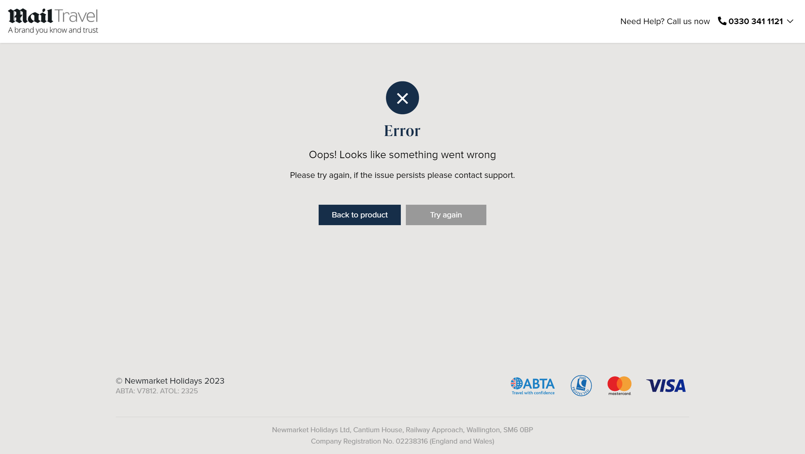

# Skip scenarios

This file explains why some scenarios are skipped and how to reproduce the defect.

## Reason for skipping

Some scenarios are skipped because the web page gives an error "Oops! Looks like something went wrong. Please try again, if the issue persists please contact support." on Chrome version 114.0.5735.110.  .

This error prevents the user from completing the booking process and verifying the details.

## Steps to reproduce

To reproduce the defect, follow these steps:

1. Open a browser and navigate to "https://www.mailtravel.co.uk/"
2. Accept all cookies
3. Enter "India" in the search bar and click on the search button
4. Select holiday package
5. Click on the book online button
6. Select any number of passengers from the dropdown
7. Select any departure date from the calendar
8. Click on the book online button again
9. Observe the error message on the web page

- Screenshot: 
- Status: Reported to ..., waiting for fix.
